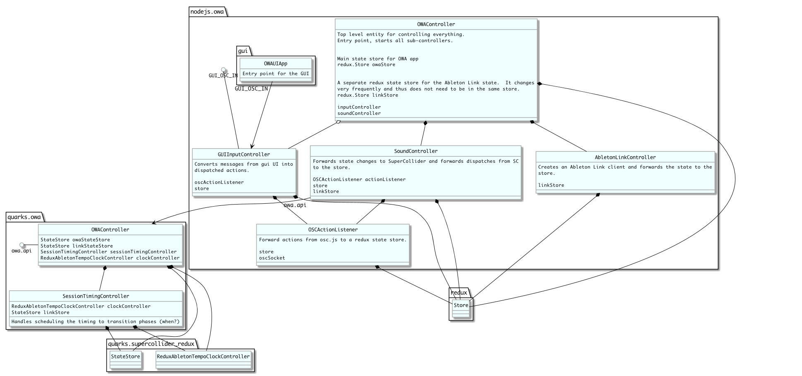

# Out of This World Advice
This codebase supports a musical interactive sculpture called Out of This World Advice (OWA):

[vimeo.com/283879746](https://vimeo.com/283879746)

## Important: Status of this Repository

Dear reader,

This code repository has been under active development during the evolution of OWA.  The software has many parts and although heavily leverages modern Node.js development practices, its integration with SuperCollider leaves the developer experience with much to be desired.

Please do reach out if you are working with this code: colin [at] awakening.io

## Software Architecture

## Directory Structure

* `ansible/`: Contains Ansible playbooks and roles for configuring and deploying Raspberry Pi
* `arduino/`: Code for deployment onto Arduino for handling button inputs, handles de-bouncing and discrepancies between specific piezos
* `docs/`: PlantUML diagrams of system architecture and data models
* `gui/`: An Electron application to simulate button presses for development
* `notebooks/`: SuperCollider scratch pads for development
* `physical/`: Model files for 3d printed button mold, laser cut pieces for the totem, etc.
* `quarks/owa/`: OWA SuperCollider package, all production SuperCollider code is contained here
* `sounds/`: All sound resources go in this directory
* `src/`: Top-level directory for Node.js source code
* `test/`: Top-level directory for tests of Node.js source code

## Dependencies

Install these manually:

* SuperCollider
* [sc3-plugins](https://github.com/supercollider/sc3-plugins)
* Node.js

### Esoteric Dependencies

These are installed with `yarn` or `Quarks.install` (steps below), they are noted here for reference.

* [cs-supercollider-lib](https://github.com/colinsullivan/cs-supercollider-lib)
* [awakening-sequencers](https://github.com/colinsullivan/awakening-sequencers)
* [supercollider-redux](https://github.com/colinsullivan/supercollider-redux)
* [supercolliderjs](https://github.com/crucialfelix/supercolliderjs)

## Dev Setup

Download the sounds (Note: this will only work from a commit where sounds were published from):

    ./retrieve_sounds.sh

Install the SuperCollider dependencies:

    sclang install.sc

Install the Node.js dependencies:

    yarn

Install `owa_env`:

    cp owa_env_example owa_env

Update variables for your dev instance.

Install `.supercollider.yaml`:

    cp .supercollider.yaml_example .supercollider.yaml

Update variables for your SuperCollider installation.

Install the GUI deps:

    cd gui && yarn

## Running GUI

    cd gui/
    source ../owa_env && npm run start

## Running in dev mode

    source owa_env && npm run start_dev

## Unit Tests

    $ npm run test

## Ansible

Install remote Ansible roles:

    $ ansible-galaxy install -r ansible_roles.yml

Set your `ansible/hosts` files with your deployment machine's hostname.

    $ ansible-playbook ansible/site.yml

## Raspberry Pi

A few notes on managing a Raspberry Pi post-deployment on the [owapi](https://github.com/awakeningio/owa/wiki/owapi) wiki page.
